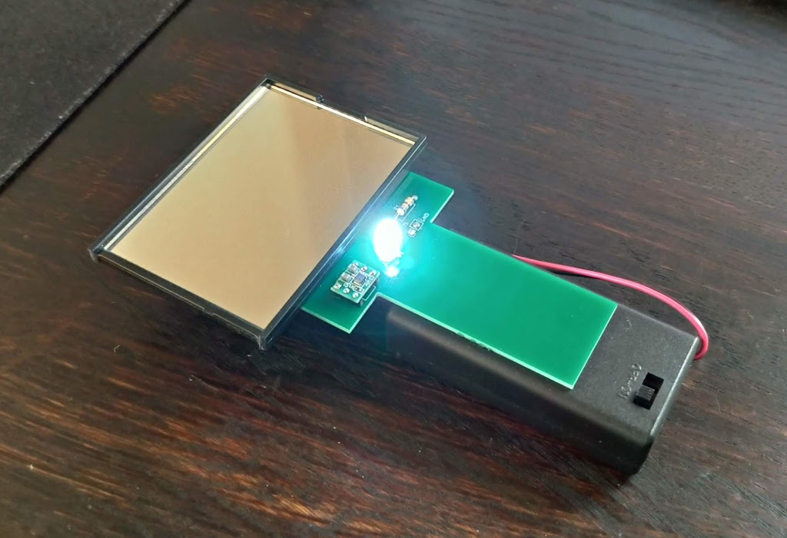

# Akashi-05

## 概要
Akashi-05は照明付き歯磨き鏡基板です。LED照明をつかうことで、口の奥まで確認しながら歯磨きを行えます。部品はすべて秋月電子で購入可能です。

設計にはKiCad 5.1.6 を使用しました。[PDF版の回路図](doc/Akashi-05.pdf)もあります。

追記：この鏡は実際に使用していますが、推奨できません。もっと光の弱いLEDを5個程度並べる構造にすべきです。私は目に光が入らないよう遮蔽版を追加して使用しています。

## 部品表

| シンボル | 部品名 | 
| -------- | -------|
| U1       | [５Ｖ出力昇圧ＤＣＤＣコンバーター](http://akizukidenshi.com/catalog/g/gK-13065/) | 
| D1       | [高輝度５ｍｍ白色ＬＥＤ](http://akizukidenshi.com/catalog/g/gI-04764/) | 
| R1       | 68Ω 1/4W 
|          | [電池ボックス 単３x２ スイッチ付き](http://akizukidenshi.com/catalog/g/gP-11523/) |

鏡は100円均一で購入したものです。電池ボックスも鏡も通常の瞬間接着剤で基板に取り付けました。材質がポリプロピレンだと特殊な接着剤が必要になるので注意してください。

LEDは取り付け後に角度調整が必要になるため、基板から少し浮かせてハンダ付けします。直視すると明るすぎますが、歯磨き中は気になりません。

完成したら電源を入れて自分の口の中を鏡に映します。LEDの明かりが口の中を綺麗に照らすようにLEDの角度を調整してください。

## ライセンス
Akashi-01は[CC 1.0 Universal](LICENSE)ライセンスで配布しています。
